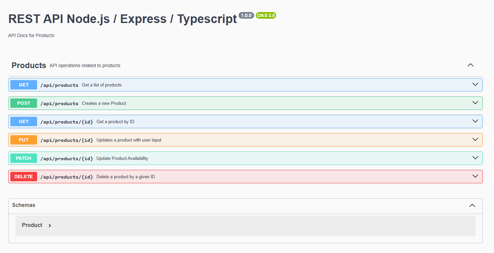

# 🛒 REST API Node + Express + TypeScript

API RESTful para la gestión de productos, desarrollada con **Node.js**, **Express**, y **TypeScript**. Utiliza **Sequelize** como ORM para una base de datos PostgreSQL y está documentada con **Swagger**. Las pruebas están escritas con **Jest** y **Supertest**.

---

## 📦 Características

- CRUD completo de productos (`GET`, `POST`, `PUT`, `PATCH`, `DELETE`)
- Validaciones con `express-validator`
- Documentación interactiva con Swagger
- Conexión a base de datos PostgreSQL con Sequelize y Sequelize-Typescript
- Tests automatizados con cobertura usando Jest + Supertest
- Tipado fuerte con TypeScript
- Variables de entorno con `dotenv`

---

## 📁 Estructura del Proyecto
src/
├── config/ # Configuración de la base de datos
├── handlers/ # Controladores para las rutas
├── middleware/ # Middlewares personalizados
├── models/ # Definición de modelos con Sequelize
├── routes/ # Definición de endpoints y documentación Swagger
├── index.ts # Punto de entrada principal
├── server.ts # Configuración del servidor Express
├── swagger.ts # Configuración de Swagger JSDoc
tests/ # Pruebas automatizadas

---

## 🚀 Instalación

```bash
# Clonar el repositorio
git clone https://github.com/tu-usuario/rest_api_node_ts_server.git
cd rest_api_node_ts_server

# Instalar dependencias
npm install
```

## 🧪 Scripts Disponibles
# Levantar en modo desarrollo con nodemon y ts-node
npm run dev

# Ejecutar tests con Jest
npm test

# Ejecutar tests con reporte de cobertura
npm run test:coverage

## 📘 Documentación Swagger
GET http://localhost:3000/docs


## Luciano Germani